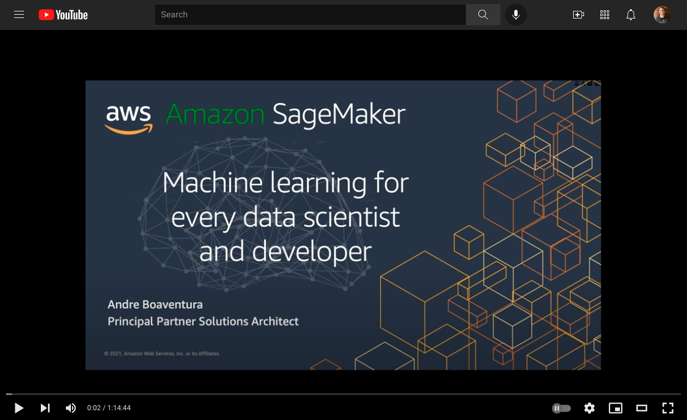

# Domain 2 - Exploratory Data Analysis & Amazon Sagemaker Overview and New features

Amazon SageMaker is a fully managed service that allows developers and data scientists  to build, train, and deploy machine learning models. There are a lot of components to SageMaker, whether you’re using the managed development environments, the ephemeral training clusters, the hyperparamater tuning, or the deployed endpoints among lots of different features and capabilities. 

We typically talk about those capabilities as falling into four categories: Data preparation, the model build phase, training and tuning, and deployment and management (or hosting). 
These four categories really address the needs that ML builders have when dealing with each stage of a model’s lifecycle. 

During this session, I will walk you through on the 4 key categories and give you a full feature tour of as many of these features that might be interesting to you. 

## Feature Engineering
- Data Wrangler and Feature Store
- Numpy and Pandas
- SageMaker Processing

[Hands-on Lab](https://sagemaker-immersionday.workshop.aws/en/lab1.html)

## Model Training with Sagemaker
[Train, Tune and Deploy model using SageMaker Built-in Algorithm and Hyperparameter Tuning](https://sagemaker-immersionday.workshop.aws/en/lab2.html)

## Backup Labs (Homework)
Exploratory Data Analysis and Feature Engineering
- https://github.com/aboavent/ai-ml-bb-2021/blob/main/week1/day2/exploratory-analysis-and-feature-engineering.ipynb

SageMaker Preprocessing Jobs Lab 
- https://github.com/saidababu/ai-ml-bb/blob/main/week2/day1/sagemaker-processing

[Autopilot](./autopilot.ipynb)

* Additonal Challenge: After the first run and understanding the concepts, please modify the notebook such that it only creates the candidate generation notebook only. Then use the notebooks to run the actual training and tuning process. Hint: search for GenerateCandidateDefinitionsOnly [here](https://boto3.amazonaws.com/v1/documentation/api/latest/reference/services/sagemaker.html#SageMaker.Client.create_auto_ml_job)

[PCA Lab](https://github.com/aws/amazon-sagemaker-examples/blob/f0a137dab6397d6e5649dc780f8278cfade4a7dc/introduction_to_amazon_algorithms/pca_mnist/pca_mnist.ipynb)

- Principal Component Analysis, or PCA, is a dimensionality-reduction method that is often used to reduce the dimensionality of large data sets, by transforming a large set of variables into a smaller one that still contains most of the information in the large set.

