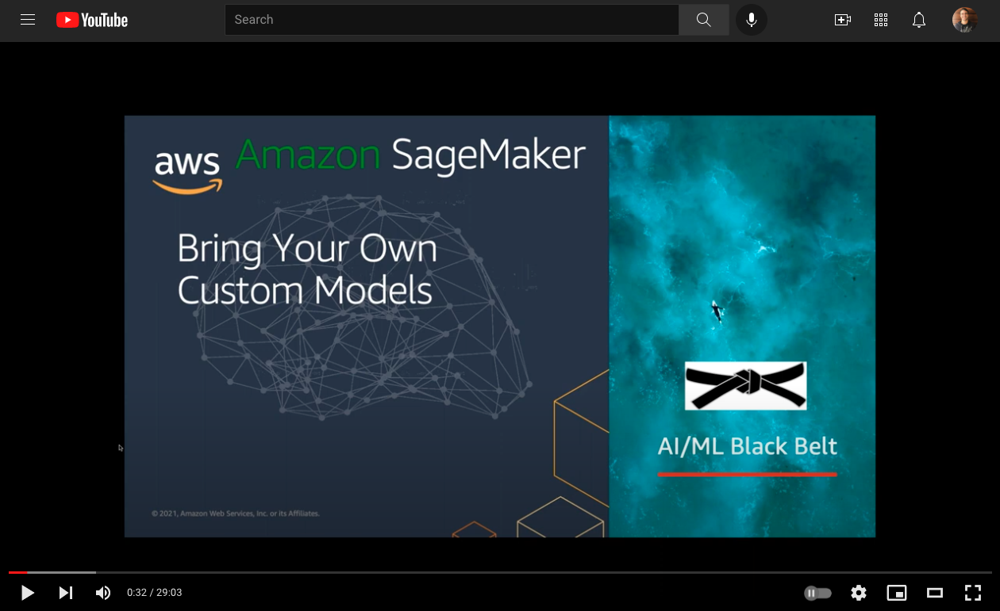

# Domain 3 - Modeling

## Bring you own Custom Models and Containers with Amazon Sagemaker

SageMaker makes extensive use of Docker containers to allow users to train and deploy algorithms. Containers allow developers and data scientists to package software into standardized units that run consistently on any platform that supports Docker. Containerization packages code, runtime, system tools, system libraries and settings all in the same place, isolating it from its surroundings, and insuring a consistent runtime regardless of where it is being run.

When you develop a model in Amazon SageMaker, you can provide separate Docker images for the training code and the inference code, or you can combine them into a single Docker image.

In this session, I dive deeply on both scenarios that use containers for Deep Learning frameworks such as Pytorch, Tensorflow, and MXNet, and custom containers where developers and data scientists can bring their own data and container to address use cases that requires the implementation of complex code with special additions to the framework including libraries, packages, etc.

### Lab
- [Bring your own training-completed Pytorch model](https://github.com/aboavent/ai-ml-bb-2021/tree/main/week1/day3/amazon-sagemaker-custom-container)

## SageMaker Clarify
- [Hands-on Lab](https://sagemaker-immersionday.workshop.aws/en/lab5.html)
- [Fairness and Explainability with SageMaker Clarify](https://github.com/pedrosola/bbmlaws/blob/master/bias_and_explainability.ipynb) 
- [Documentation](https://sagemaker-examples.readthedocs.io/en/latest/sagemaker_processing/fairness_and_explainability/fairness_and_explainability.html)

## SageMaker Well-Architected

Security on Amazon SageMaker 
- [Implementing Guard Rails](https://d96a2n0rdrgcs.cloudfront.net/security_for_sysops/best_practice.html)
- [Secure Networking](https://d96a2n0rdrgcs.cloudfront.net/security_for_sysops/team_resources.html)
- [Secure Notebook](https://d96a2n0rdrgcs.cloudfront.net/security_for_sysops/secure_notebook.html)

## Backup Labs (Homework)

- [Bring your Own Script - Tensorflow in Script Mode](https://sagemaker-immersionday.workshop.aws/en/lab3/option2.html)

- [Bring your own container](https://sagemaker-immersionday.workshop.aws/en/lab3/option1.html)

- [Using Custom Algorithms](https://sagemaker-workshop.com/custom.html)

- [Bring-your-own Algorithm Sample](https://github.com/aws/amazon-sagemaker-examples/tree/master/advanced_functionality/scikit_bring_your_own/container)
Here is a comprehensive [blog post](https://aws.amazon.com/blogs/machine-learning/train-and-host-scikit-learn-models-in-amazon-sagemaker-by-building-a-scikit-docker-container/) on the BYOC topic based on this example 

- [Sagemaker Labs](https://catalog.us-east-1.prod.workshops.aws/v2/workshops/6ff48ab1-6732-4108-afaa-b598665fb4b0/en-US/sagemaker-labs)

These labs cover SageMaker's built-in algortihms and how to create your own custom algorithms. The built-in algorithms are ready-to-use, scalable, and optimized for the AWS environment, as exemplified in the XGBoostLab. The main Deep Learning Frameworks: PyTorch, Tensor Flow, and Apache MXNet are all supported, and each has an associated lab.

## Additional Resources
- https://aws.amazon.com/blogs/mt/enable-self-service-secured-data-science-using-amazon-sagemaker-notebooks-and-aws-service-catalog/
- https://docs.aws.amazon.com/wellarchitected/latest/machine-learning-lens/machine-learning-lens.html
- https://aws.amazon.com/blogs/opensource/why-use-docker-containers-for-machine-learning-development/

