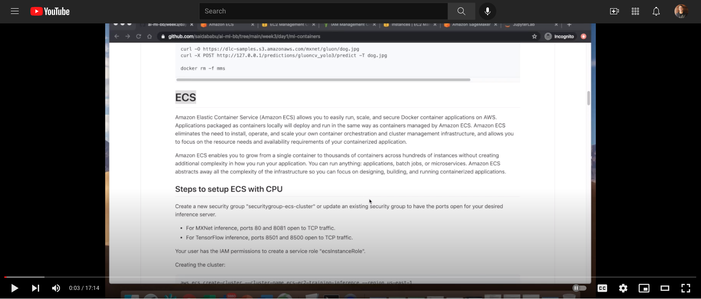

# AWS Deep Learning Containers Setup with EC2, ECS, and EKS
AWS Deep Learning Containers are available as Docker images in Amazon ECR. Each Docker image is built for training or inference on a specific Deep Learning framework version, python version, with CPU or GPU support.

https://docs.aws.amazon.com/deep-learning-containers/latest/devguide/getting-started.html

https://aws.amazon.com/getting-started/hands-on/get-started-dlami/

# EC2
```
aws ecr get-login-password --region us-east-1 | docker login --username AWS --password-stdin 763104351884.dkr.ecr.us-east-1.amazonaws.com
```

### Available Deep Learning Containers Images
https://github.com/aws/deep-learning-containers/blob/master/available_images.md

### Pytorch Training (CPU-based)
``` 
docker run -it 763104351884.dkr.ecr.us-east-1.amazonaws.com/pytorch-training:1.6.0-cpu-py36-ubuntu16.04

git clone https://github.com/pytorch/examples.git

## Change training parameters: 3 epochs only (lines 80-81) 

python examples/mnist/main.py --no-cuda
``` 

### PyTorch Inference (CPU-based)
```
docker run -itd --name torchserve -p 80:8080 -p 8081:8081 763104351884.dkr.ecr.us-east-1.amazonaws.com/pytorch-inference:1.6.0-cpu-py36-ubuntu16.04 \
torchserve --start --ts-config /home/model-server/config.properties \
--models pytorch-densenet=https://torchserve.s3.amazonaws.com/mar_files/densenet161.mar

curl -O https://s3.amazonaws.com/model-server/inputs/flower.jpg
curl -X POST http://127.0.0.1:80/predictions/pytorch-densenet -T flower.jpg

docker rm -f torchserve
```

### Apache MXNet(Incubating and GluonCV) training (CPU-based)
``` 
docker run -it 763104351884.dkr.ecr.us-east-1.amazonaws.com/mxnet-training:1.7.0-cpu-py36-ubuntu16.04

git clone -b v1.4.x https://github.com/apache/incubator-mxnet.git
python incubator-mxnet/example/image-classification/train_mnist.py

git clone -b v0.6.0 https://github.com/dmlc/gluon-cv.git
python gluon-cv/scripts/classification/cifar/train_cifar10.py --model resnet18_v1b
``` 

### Apache MXNet (Incubating) Inference (CPU-based)
```
docker run -it --name mms -p 80:8080  -p 8081:8081 763104351884.dkr.ecr.us-east-1.amazonaws.com/mxnet-inference:1.7.0-cpu-py36-ubuntu16.04 \
mxnet-model-server --start --mms-config /home/model-server/config.properties \
--models squeezenet=https://s3.amazonaws.com/model-server/models/squeezenet_v1.1/squeezenet_v1.1.model

curl -O https://s3.amazonaws.com/model-server/inputs/kitten.jpg
curl -X POST http://127.0.0.1/predictions/squeezenet -T kitten.jpg

docker rm -f mms

```

### Apache MXNet (GluonCV) Inference (CPU-based)

```
docker run -it --name mms -p 80:8080  -p 8081:8081 763104351884.dkr.ecr.us-east-1.amazonaws.com/mxnet-inference:1.7.0-cpu-py36-ubuntu16.04 \
mxnet-model-server --start --mms-config /home/model-server/config.properties \
--models gluoncv_yolo3=https://dlc-samples.s3.amazonaws.com/mxnet/gluon/gluoncv_yolo3.mar

curl -O https://dlc-samples.s3.amazonaws.com/mxnet/gluon/dog.jpg
curl -X POST http://127.0.0.1/predictions/gluoncv_yolo3/predict -T dog.jpg

docker rm -f mms
```

# ECS
Amazon Elastic Container Service (Amazon ECS) allows you to easily run, scale, and secure Docker container applications on AWS. Applications packaged as containers locally will deploy and run in the same way as containers managed by Amazon ECS. Amazon ECS eliminates the need to install, operate, and scale your own container orchestration and cluster management infrastructure, and allows you to focus on the resource needs and availability requirements of your containerized application.

Amazon ECS enables you to grow from a single container to thousands of containers across hundreds of instances without creating additional complexity in how you run your application. You can run anything: applications, batch jobs, or microservices. Amazon ECS abstracts away all the complexity of the infrastructure so you can focus on designing, building, and running containerized applications.

[](https://www.youtube.com/embed/6b0TC3V1ZJM)

## Steps to setup ECS with CPU (watch the video above for more details if needed)
Create a new security group **"securitygroup-ecs-cluster"** or update an existing security group to have the ports open for your desired inference server.

- Inbound Rules: For MXNet inference, ports 80 and 8081 open for TCP traffic. For TensorFlow inference, ports 8501 and 8500 open to TCP traffic.

- Outbound Rules: All traffic 0.0.0.0/0

Make sure your user has IAM permissions to create a service role "ecsInstanceRole". 


Creating the cluster:

```
aws ecs create-cluster --cluster-name ecs-ec2-training-inference --region us-east-1
```

Create a file named **my_script.txt** with the following contents. Reference the same cluster name that you created in the previous step.
```
#!/bin/bash
echo ECS_CLUSTER=ecs-ec2-training-inference >> /etc/ecs/ecs.config
```
Create a file named **my_mapping.txt** with the following content, which changes the size of the root volume after the instance is created.
```
[
    {
        "DeviceName": "/dev/xvda",
        "Ebs": {
            "VolumeSize": 100
        }
    }
]
```
### Amazon ECS-optimized AMIs
https://docs.aws.amazon.com/AmazonECS/latest/developerguide/ecs-optimized_AMI.html

Launch an Amazon EC2 instance with the Amazon ECS-optimized AMI and attach it to the cluster. Use the security group (**securitygroup-ecs-cluster**) and key pair name(**andre-DL** in the example below, but it can be whatever key you create) and replace them in the following command as needed
```
aws ec2 run-instances --image-id ami-0669eafef622afea1 \
                       --count 1 \
                       --instance-type m5.2xlarge \
                       --key-name andre-DL \
                       --security-group-ids securitygroup-ecs-cluster \
                       --iam-instance-profile Name="ecsInstanceRole" \
                       --user-data file://my_script.txt \
                       --block-device-mapping file://my_mapping.txt \
                       --region us-east-1
```

### Pytorch Training (CPU-based)
Create a file named **ecs-deep-learning-container-training-taskdef.json** with the following contents.
``` 
{
   "requiresCompatibilities":[
      "EC2"
   ],
   "containerDefinitions":[
      {
         "command":[
            "git clone https://github.com/pytorch/examples.git && python examples/mnist/main.py --no-cuda"
         ],
         "entryPoint":[
            "sh",
            "-c"
         ],
         "name":"pytorch-training-container",
         "image":"763104351884.dkr.ecr.us-east-1.amazonaws.com/pytorch-training:1.5.1-cpu-py36-ubuntu16.04",
         "memory":4000,
         "cpu":256,
         "essential":true,
         "portMappings":[
            {
               "containerPort":80,
               "protocol":"tcp"
            }
         ],
         "logConfiguration":{
            "logDriver":"awslogs",
            "options":{
               "awslogs-group":"/ecs/pytorch-training-cpu",
               "awslogs-region":"us-east-1",
               "awslogs-stream-prefix":"mnist",
               "awslogs-create-group":"true"
            }
         }
      }
   ],
   "volumes":[

   ],
   "networkMode":"bridge",
   "placementConstraints":[

   ],
   "family":"pytorch"
}
``` 

Register the task definition. Note the revision number in the output and use it in the next step.
``` 
aws ecs register-task-definition --cli-input-json file://ecs-deep-learning-container-training-taskdef.json
``` 

Create a task using the task definition. You need the revision identifier from the previous step.
``` 
aws ecs run-task --cluster ecs-ec2-training-inference --task-definition pytorch:1
``` 


### PyTorch Inference (CPU-based)
Create a file named ecs-dlc-cpu-inference-taskdef.json with the following contents.

```
{
    "requiresCompatibilities": [
        "EC2"
    ],
    "containerDefinitions": [{
        "command": [
            "mxnet-model-server --start --mms-config /home/model-server/config.properties --models densenet=https://dlc-samples.s3.amazonaws.com/pytorch/multi-model-server/densenet/densenet.mar"
        ],
        "name": "pytorch-inference-container",
        "image": "763104351884.dkr.ecr.us-east-1.amazonaws.com/pytorch-inference:1.3.1-cpu-py36-ubuntu16.04",
        "memory": 8111,
        "cpu": 256,
        "essential": true,
        "portMappings": [{
                "hostPort": 8081,
                "protocol": "tcp",
                "containerPort": 8081
            },
            {
                "hostPort": 80,
                "protocol": "tcp",
                "containerPort": 8080
            }
        ],
        "logConfiguration": {
            "logDriver": "awslogs",
            "options": {
                "awslogs-group": "/ecs/densenet-inference-cpu",
                "awslogs-region": "us-east-1",
                "awslogs-stream-prefix": "densenet",
                "awslogs-create-group": "true"
            }
        }
    }],
    "volumes": [],
    "networkMode": "bridge",
    "placementConstraints": [],
    "family": "pytorch-inference"
}
```
Register the task definition. Note the revision number in the output and use it in the next step.
```
aws ecs register-task-definition --cli-input-json file://ecs-dlc-cpu-inference-taskdef.json
```
Create an Amazon ECS service. When you specify the task definition, replace revision_id with the revision number of the task definition from the output of the previous step.
```
aws ecs create-service --cluster ecs-ec2-training-inference \
                       --service-name cli-ec2-inference-cpu \
                       --task-definition pytorch-inference:1 \
                       --desired-count 1 \
                       --launch-type EC2 \
                       --scheduling-strategy REPLICA \
                       --region us-east-1
```

Verify the service and get the network endpoint by completing the following steps:

- Open the Amazon ECS console at https://console.aws.amazon.com/ecs/.

- Select the ecs-ec2-training-inference cluster.

- On the Cluster page, choose Services and then cli-ec2-inference-cpu.

- After your task is in a RUNNING state, choose the task identifiter.

- Under Containers, expand the container details.

- Under Name and then Network Bindings, under External Link note the IP address for port 8081 and use it in the next step.

- Under Log Configuration, choose View logs in CloudWatch. This takes you to the CloudWatch console to view the training progress logs.

To run inference, use the following command. Replace the external IP address with the external link IP address from the previous step.
```
curl -O https://s3.amazonaws.com/model-server/inputs/flower.jpg
curl -X POST http://<External ip>/predictions/densenet -T flower.jpg
```

# EKS

To setup an Amazon EKS cluster, use the open source tool, eksctl. We recommend that you use an Amazon EC2 instance with the Deep Learning Base AMI (Ubuntu) to allocate and control your cluster. You can run these tools locally on your computer or an Amazon EC2 instance that you already have running. We refer to this as your gateway node.

## EKS Setup (CPU-based)

Install or upgrade AWS CLI. To access the required new Kubernetes features, you must have the latest version.
```
sudo pip install --upgrade awscli
```

Install eksctl by running the following commands
```
curl --silent --location "https://github.com/weaveworks/eksctl/releases/latest/download/eksctl_$(uname -s)_amd64.tar.gz" | tar xz -C /tmp
sudo mv /tmp/eksctl /usr/local/bin
```
Install kubectl by running the following commands
```
curl -o kubectl https://amazon-eks.s3-us-west-2.amazonaws.com/1.11.5/2018-12-06/bin/linux/amd64/kubectl
chmod +x ./kubectl
mkdir -p $HOME/bin && cp ./kubectl $HOME/bin/kubectl && export PATH=$HOME/bin:$PATH
```

Install aws-iam-authenticator by running the following commands
```
curl -o aws-iam-authenticator https://amazon-eks.s3-us-west-2.amazonaws.com/1.11.5/2018-12-06/bin/linux/amd64/aws-iam-authenticator
chmod +x aws-iam-authenticator
cp ./aws-iam-authenticator $HOME/bin/aws-iam-authenticator && export PATH=$HOME/bin:$PATH
```
Install ksonnet
```
export KS_VER=0.13.1
export KS_PKG=ks_${KS_VER}_linux_amd64
wget -O /tmp/${KS_PKG}.tar.gz https://github.com/ksonnet/ksonnet/releases/download/v${KS_VER}/${KS_PKG}.tar.gz
mkdir -p ${HOME}/bin
tar -xvf /tmp/$KS_PKG.tar.gz -C ${HOME}/bin
sudo mv ${HOME}/bin/$KS_PKG/ks /usr/local/bin
```
```
Create an IAM user with AdministratorAcesss(only to make the steps of this lab easier) and copy both the AWS Access Key and AWS Secret Access Key. Then, run **aws configure** and used them to populate the fields **Access Key** and **Secret Access Key** by pasting them into the prompts for the aws configure command.
```

Create the key pair
```
aws ec2 create-key-pair --key-name DL-keypair --query 'KeyMaterial' --output text > DL-keypair.pem
```


Create EKS cluster. **Please note that the step below usually takes 10-15 minutes.**
```
eksctl create cluster eksdl \
                      --version 1.17 \
                      --nodes 3 \
                      --node-type=c5.4xlarge \
                      --timeout=40m \
                      --ssh-access \
                      --ssh-public-key DL-keypair \
                      --region us-east-1 \
                      --auto-kubeconfig
```

Checking if your EKS cluster is up and running
```
aws eks --region us-east-1 update-kubeconfig --name eksdl

kubectl get nodes -o wide

aws eks --region us-east-1 describe-cluster --name eksdl --query cluster.status

kubectl get pods
```

## Pytorch Training (CPU-based)
Create a pod file for your cluster. Save this file as **pytorch.yaml**

```
apiVersion: v1
kind: Pod
metadata:
  name: pytorch-training
spec:
  restartPolicy: OnFailure
  containers:
  - name: pytorch-training
    image: 763104351884.dkr.ecr.us-east-1.amazonaws.com/pytorch-training:1.5.1-cpu-py36-ubuntu16.04
    command:
      - "/bin/sh"
      - "-c"
    args:
    - "git clone https://github.com/pytorch/examples.git && python examples/mnist/main.py --no-cuda"
    env:
    - name: OMP_NUM_THREADS
      value: "36"
    - name: KMP_AFFINITY
      value: "granularity=fine,verbose,compact,1,0"
    - name: KMP_BLOCKTIME
      value: "1"
```

Assign the pod file to the cluster using kubectl and check status. You can also continue to check “get pods” to refresh the status. When the status changes to “Completed” you will know that the training job is done.

```
kubectl create -f pytorch.yaml

kubectl get pods

kubectl describe pod pytorch

kubectl logs pytorch-training
```

## Pytorch Inference (CPU-based)
Create the namespace. You may need to change the kubeconfig to point to the right cluster

```
NAMESPACE=pt-inference; kubectl create namespace ${NAMESPACE}
```

Create a file named **pt_inference.yaml** with the following content

```
---
kind: Service
apiVersion: v1
metadata:
  name: densenet-service
  labels:
    app: densenet-service
spec:
  ports:
  - port: 8080
    targetPort: mms
  selector:
    app: densenet-service
---
kind: Deployment
apiVersion: apps/v1
metadata:
  name: densenet-service
  labels:
    app: densenet-service
spec:
  replicas: 1
  selector:
    matchLabels:
      app: densenet-service
  template:
    metadata:
      labels:
        app: densenet-service
    spec:
      containers:
      - name: densenet-service
        image: 763104351884.dkr.ecr.us-east-1.amazonaws.com/pytorch-inference:1.3.1-cpu-py36-ubuntu16.04
        args:
        - mxnet-model-server
        - --start
        - --mms-config /home/model-server/config.properties
        - --models densenet=https://dlc-samples.s3.amazonaws.com/pytorch/multi-model-server/densenet/densenet.mar
        ports:
        - name: mms
          containerPort: 8080
        - name: mms-management
          containerPort: 8081
        imagePullPolicy: IfNotPresent
```

Apply the configuration to a new pod in the previously defined namespace and check the status of the pod and wait for the pod to be in “RUNNING” state:

```
kubectl -n ${NAMESPACE} apply -f pt_inference.yaml
kubectl get pods -n ${NAMESPACE} -w
kubectl describe pod <pod_name> -n ${NAMESPACE}
```

Because the serviceType here is ClusterIP, you can forward the port from your container to your host machine.

```
kubectl port-forward -n ${NAMESPACE} `kubectl get pods -n ${NAMESPACE} --selector=app=densenet-service -o jsonpath='{.items[0].metadata.name}'` 8080:8080 &
```

With your server started, you can now run inference from a different window using the following

```
curl -O https://s3.amazonaws.com/model-server/inputs/flower.jpg
curl -X POST http://127.0.0.1:8080/predictions/densenet -T flower.jpg
```

