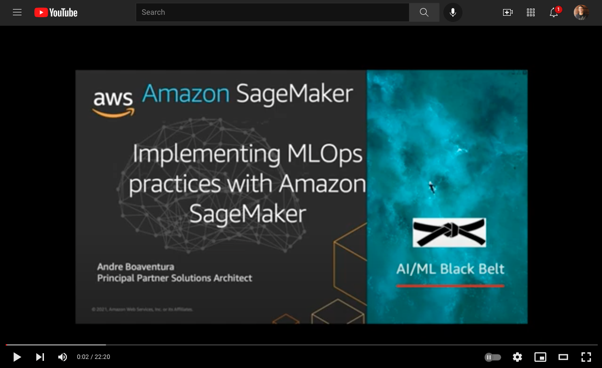

# Domain 4: ML Implementation and Operations

## Amazon SageMaker Safe Deployment Pipeline
Advanced Blue/Green Deployment Pipeline with CodePipeline, CodeCommit, CodeBuild, and CodeDeploy using SageMaker features such as Experiments & Model Monitor as well as building a pipeline to train and deploy a model built using SageMaker's XGBoost built-in-algorithm. 
- https://github.com/aws-samples/amazon-sagemaker-safe-deployment-pipeline

## SageMaker Pipelines
- https://github.com/aboavent/ai-ml-bb-2021/tree/main/week2/day1/deeplearning-containers

## Additional Resources & Labs

### Machine Learning using Kubeflow
- https://www.eksworkshop.com/advanced/420_kubeflow/
 
### MLOps
MLOps refers to a methodology that is built on applying DevOps practices to machine learning workloads. DevOps focuses on the intersection of development and operations disciplines to streamline software delivery across the Software Development Lifecycle(SDLC). MLOps focuses on the intersection of data science, data engineering in combination with existing DevOps practices to streamline model delivery across the Machine Learning Development Lifecycle (MLDC).

https://github.com/aws-samples/mlops-amazon-sagemaker-devops-with-ml

**Solutions:**

* [AWS MLOps Framework Solution](https://aws.amazon.com/solutions/implementations/aws-mlops-framework/): This is a one-click to deploy solution published in the *AWS Solutions Library*  that creates a pre-configured pipeline. 

**Labs/Workshops:**
* [Built-In-Algorithm - Simple Pipeline](/1-Built-In-Algorithm/README.md): Simple pipeline to train and deploy a model built using SageMaker's XGBoost built-in-algorithm along with CodePipeline, CloudFormation, StepFunctions & Lambda. 
* [Built-In-Algorithm - Cross Account](/3-Built-In-Algorithm-Cross-Acccount/README.md): Cross account pipeline to train and deploy a model built using SageMaker's XGBoost built-in-algorithm along with CodePipeline & Lambda. 
* [Bring-Your-Own-Algorithm - Simple Pipeline](/2-Bring-Your-Own/README.md): Simple pipeline to build a SageMaker compatible docker image, then train and deploy a model built using scikit along with CodePipeline, CodeBuild, CloudFormation, StepFunctions & Lambda. 
* [Built-In-Algorithm - Jenkins Pipeline](/4-Built-In-Algorithm-Jenkins/README.md): Simple Jenkins pipeline to train and deploy a model built using SageMaker's XGBoost built-in-algorithm. 
* [MLOps Workshop - End-to-End Builders Workshop](https://operational-machine-learning-pipeline.workshop.aws/module_introduction_1.html)
* [SageMaker Pipelines](https://github.com/aws/amazon-sagemaker-examples/tree/master/sagemaker-pipelines)
* [MLflow (Open Machine Learning Platform) on AWS](https://github.com/aws-samples/aws-mlflow-sagemaker-cdk)

### Asynchronous Inference
* https://github.com/aws/amazon-sagemaker-examples/tree/master/async-inference
